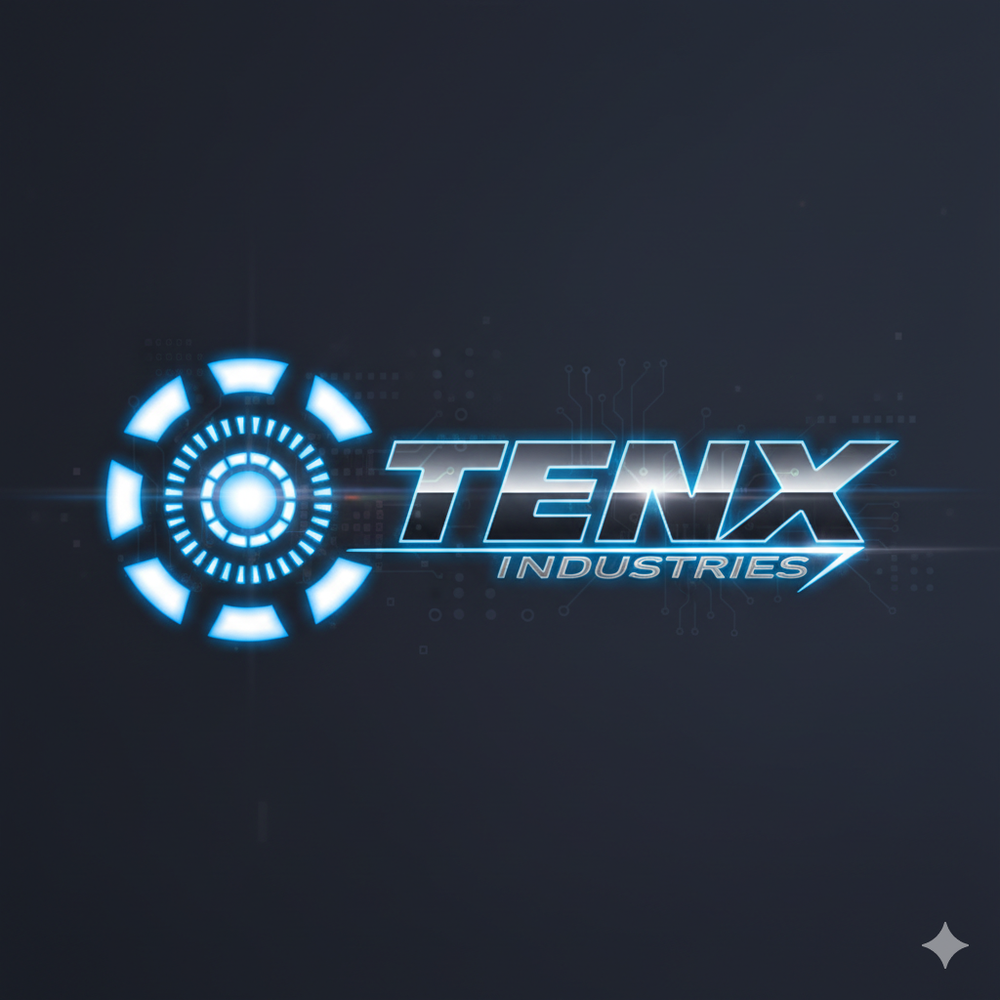

<p align="center">
  
</p>

<h1 align="center">TENX Track Learning</h1>

<p align="center">
  <strong>Your Personal AI/ML/DL/DS Learning Operating System</strong><br/>
  Track courses, research papers, daily tasks, study hours & stay ahead with trending AI news — all in one premium dashboard.
</p>

<p align="center">
  
  
  
  
  
  
</p>

---

## ✨ Features

| Feature | Description |
|---------|-------------|
| 📋 **Daily Task Manager** | Plan, prioritize & track daily learning tasks with time scheduling, priority levels (High/Medium/Low), and completion analytics |
| 📚 **Course Curriculum Tracker** | Organize courses with hierarchical topics & subtopics, attach resources (PDFs, videos, links), track progress |
| 📄 **Research Paper Manager** | Track papers with reading progress (%), notes, author info, and visual progress history charts |
| 📰 **AI/ML Trending News** | Real-time AI, ML, DL & DS news powered by GNews API — auto-categorized & refreshed |
| 🤖 **AI-Powered Quotes & Facts** | Daily inspiration with unique AI-generated quotes from Groq AI (GPT-class model) |
| 📊 **Analytics & Heatmaps** | Interactive charts (Chart.js), GitHub-style activity heatmaps, progress tracking |
| ⏱️ **Study Timer & Countdown** | Persistent stopwatch & countdown timer to track study sessions and deadlines |
| 🏆 **Milestone & Streak System** | 50+ progressive milestones across 5 tiers, daily streak tracking with fire animations |
| 👤 **Profile & Settings** | User profile management, avatar, stats overview, password update |
| 🔐 **Supabase Auth** | Secure authentication with email/password signup & login |

---

## 🎨 Design & UI

TenX features a **premium dark theme** with modern design effects:

- 🌌 **Aurora ambient background glow** with floating particles
- 💎 **Glassmorphism v2** — frosted glass panels with backdrop blur
- ✨ **Card effects** — mouse-tracking glow, shine sweep, 3D tilt, neon borders
- 🎯 **Scroll reveal animations** — fade up, slide left/right, scale in
- 🔘 **Button effects** — ripple on click, glow on hover, icon micro-animations
- 📈 **Staggered entry animations** for cards, stats, and list items
- 🎭 **Gradient text shimmer**, progress bar shimmer, skeleton loading
- 🖱️ **Interactive hover effects** — lift, border glow, badge bounce
- 📱 **Fully responsive** — mobile, tablet, and desktop optimized
- ♿ **Accessibility** — focus-visible states, reduced-motion support

---

## 🏗️ Tech Stack

### Frontend
- **React 19** — Component-based UI with hooks
- **Vite 7** — Lightning-fast dev server & build
- **React Router 7** — Client-side routing
- **Chart.js + react-chartjs-2** — Interactive charts
- **Lucide React** — Beautiful icon system
- **Vanilla CSS** — Custom design system with CSS variables

### Backend
- **Node.js + Express** — REST API server
- **Supabase** — PostgreSQL database + Auth
- **Groq AI API** — AI-generated quotes & facts
- **GNews API** — Trending tech news feed

### Mobile (Android)
- **React Native + Expo** — Cross-platform mobile app
- **Shared API** — Syncs with the same backend

---

## 📁 Project Structure

```
TenX Dashboard/
├── public/                  # Static assets (logo, favicon)
├── src/
│   ├── components/          # Reusable components
│   │   ├── Charts.jsx       # Chart.js wrapper components
│   │   ├── Heatmap.jsx      # GitHub-style activity heatmap
│   │   ├── Modal.jsx        # Reusable modal component
│   │   ├── Sidebar.jsx      # Navigation sidebar
│   │   └── Timers.jsx       # Stopwatch & countdown
│   ├── contexts/            # React Context providers
│   │   ├── AuthContext.jsx   # Authentication state
│   │   ├── DataContext.jsx   # Data management (CRUD)
│   │   └── ThemeContext.jsx  # Theme provider
│   ├── pages/               # Page components
│   │   ├── Landing.jsx/css   # Marketing landing page
│   │   ├── Login.jsx/css     # Auth (login + signup)
│   │   ├── Dashboard.jsx/css # Main dashboard
│   │   ├── DailyTasks.jsx/css # Task management
│   │   ├── Courses.jsx/css   # Course tracker
│   │   ├── CourseDetail.jsx/css # Course details + topics
│   │   ├── Research.jsx/css  # Research papers
│   │   ├── ResearchDetail.jsx/css # Paper details
│   │   ├── Trending.jsx/css  # AI/ML news feed
│   │   └── Profile.jsx/css  # User profile
│   ├── utils/               # Helper utilities
│   ├── config.js            # Frontend configuration
│   ├── App.jsx              # Root component + routing
│   ├── App.css              # Layout styles
│   ├── index.css            # Design system + global styles
│   └── main.jsx             # React entry point
├── server/
│   ├── index.js             # Express API server
│   ├── .env                 # Environment variables
│   ├── .env.example         # Template for env vars
│   └── supabase-schema.sql  # Database schema
├── tenx-mobile/             # Android/iOS mobile app
│   ├── App.js               # React Native entry
│   ├── src/                 # Mobile app source
│   └── README.md            # Mobile setup guide
├── index.html               # HTML template
├── vite.config.js           # Vite configuration
├── package.json             # Frontend dependencies
└── README.md                # This file
```

---

## 🚀 Quick Start

### Prerequisites

- **Node.js** ≥ 18.x
- **npm** ≥ 9.x
- A **Supabase** account (free tier works)
- **GNews API key** (free at [gnews.io](https://gnews.io))
- **Groq API key** (free at [console.groq.com](https://console.groq.com))

### 1. Clone the Repository

```bash
git clone https://github.com/hitenstark10/tenx_tracking.git
cd tenx_tracking
```

### 2. Setup Supabase

1. Create a new project at [supabase.com](https://supabase.com)
2. Go to **SQL Editor** and run the schema:
   ```sql
   -- Run the contents of server/supabase-schema-v3.sql
   ```
3. Copy your project URL, anon key, and service key

### 3. Configure Environment Variables

```bash
# Copy the example env file
cp server/.env.example server/.env
```

Edit `server/.env`:
```env
PORT=5005
FRONTEND_URL=http://127.0.0.1:5173

# Supabase
SUPABASE_URL=https://your-project.supabase.co
SUPABASE_ANON_KEY=your-anon-key
SUPABASE_SERVICE_KEY=your-service-role-key

# GNews API
GNEWS_API_KEY=your-gnews-api-key
GNEWS_MAX_CALLS_PER_DAY=5

# Groq AI API
GROQ_API_KEY=your-groq-api-key
GROQ_MODEL=openai/gpt-oss-120b
GROQ_MAX_CALLS_PER_DAY=10
```

### 4. Install Dependencies

```bash
# Frontend
npm install

# Backend
cd server
npm install
cd ..
```

### 5. Run the Application

**Terminal 1 — Backend:**
```bash
cd server
npm run dev
```
> Server runs on `http://127.0.0.1:5005`

**Terminal 2 — Frontend:**
```bash
npm run dev
```
> App runs on `http://127.0.0.1:5173`

### 6. Build for Production

```bash
npm run build
```
The production build outputs to `dist/`.

---

## 📱 Mobile App

The `tenx-mobile/` directory contains a React Native (Expo) app that syncs with the same backend. See [tenx-mobile/README.md](tenx-mobile/README.md) for setup instructions.

**Quick start:**
```bash
cd tenx-mobile
npm install
npx expo start
```

---

## 🌐 Deployment

### Frontend (Vercel / Netlify)

1. Connect your GitHub repo
2. Set build command: `npm run build`
3. Set output directory: `dist`
4. Add environment variable: `VITE_API_URL=https://your-api.com`

### Backend (Railway / Render)

1. Deploy the `server/` directory
2. Set all environment variables from `.env`
3. Start command: `npm start`

See [DEPLOYMENT.md](DEPLOYMENT.md) for detailed deployment instructions.

---

## 🔌 API Endpoints

| Method | Endpoint | Description |
|--------|----------|-------------|
| `POST` | `/api/auth/signup` | Create new account |
| `POST` | `/api/auth/login` | Sign in |
| `POST` | `/api/auth/update-password` | Update password |
| `GET` | `/api/quotes/random` | Get AI-generated quote |
| `GET` | `/api/news` | Fetch trending AI/ML news |
| `GET` | `/api/data/:userId` | Get all user data |
| `PUT` | `/api/data/:userId` | Update user data |
| `GET` | `/api/profile/:userId` | Get user profile |
| `PUT` | `/api/profile/:userId` | Update user profile |
| `GET` | `/api/resources/:userId` | Get user resources |
| `PUT` | `/api/resources/:userId` | Update user resources |

---

## 🎯 Milestones & Tiers

| Tier | Name | Requirements |
|------|------|-------------|
| 🥉 Bronze | Beginner | 5+ tasks, 5+ hrs study |
| 🥈 Silver | Intermediate | 25+ tasks, 25+ hrs study, 2+ courses |
| 🥇 Gold | Advanced | 100+ tasks, 100+ hrs, 5+ courses |
| 💎 Diamond | Expert | 250+ tasks, 250+ hrs, 10+ courses |
| 👑 Legend | Master | 500+ tasks, 500+ hrs, 20+ courses |

---

## 🤝 Contributing

We welcome contributions! Here's how:

1. **Fork** the repository
2. **Create** a feature branch: `git checkout -b feature/amazing-feature`
3. **Commit** your changes: `git commit -m 'Add amazing feature'`
4. **Push** to the branch: `git push origin feature/amazing-feature`
5. **Open** a Pull Request

### Development Guidelines
- Follow the existing CSS design system (use CSS variables)
- Maintain dark theme consistency
- Add animations using the existing keyframes
- Keep components under 300 lines
- Test on mobile viewports

---

## 📄 License

This project is open-source and available under the [MIT License](LICENSE).

---

## 🙏 Acknowledgments

- [React](https://react.dev) — UI Library
- [Vite](https://vite.dev) — Build Tool
- [Supabase](https://supabase.com) — Backend as a Service
- [Chart.js](https://www.chartjs.org) — Charts
- [Lucide Icons](https://lucide.dev) — Icon System
- [Groq AI](https://groq.com) — AI Quotes Generation
- [GNews](https://gnews.io) — News API
- [Uiverse.io](https://uiverse.io) — UI Design Inspiration

---

<p align="center">
  Made with ❤️ by <strong>TENX Industries</strong><br/>
  <em>Track your 10X learning journey</em>
</p>
